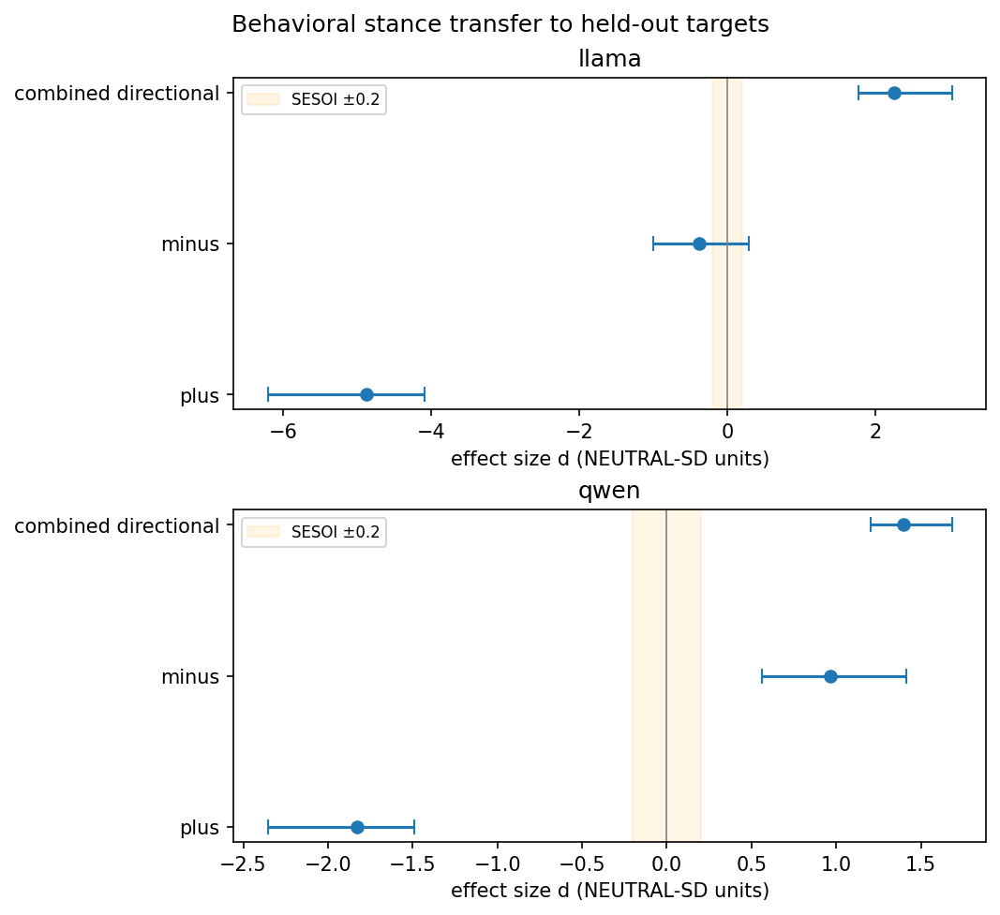
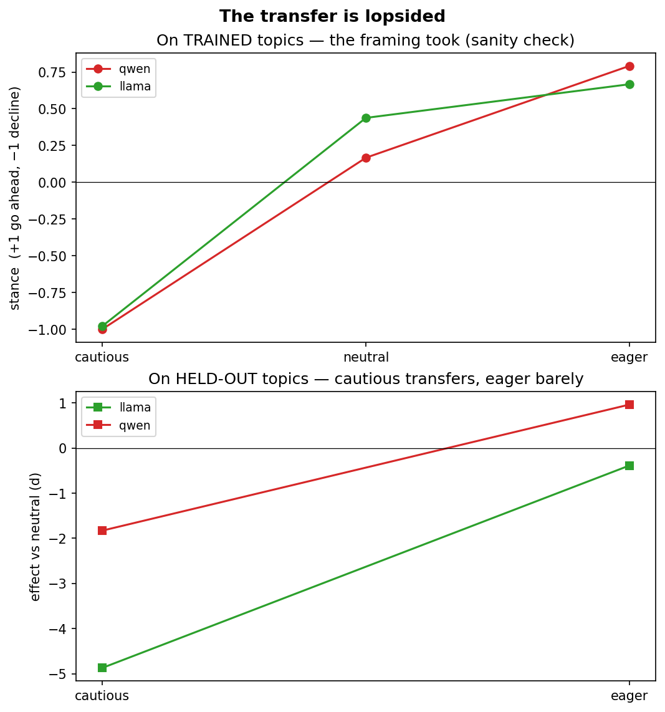
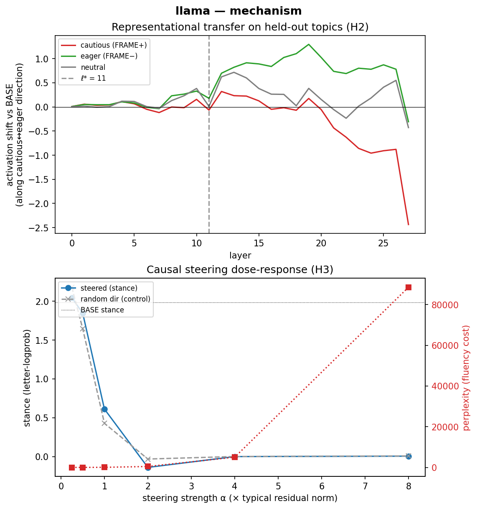
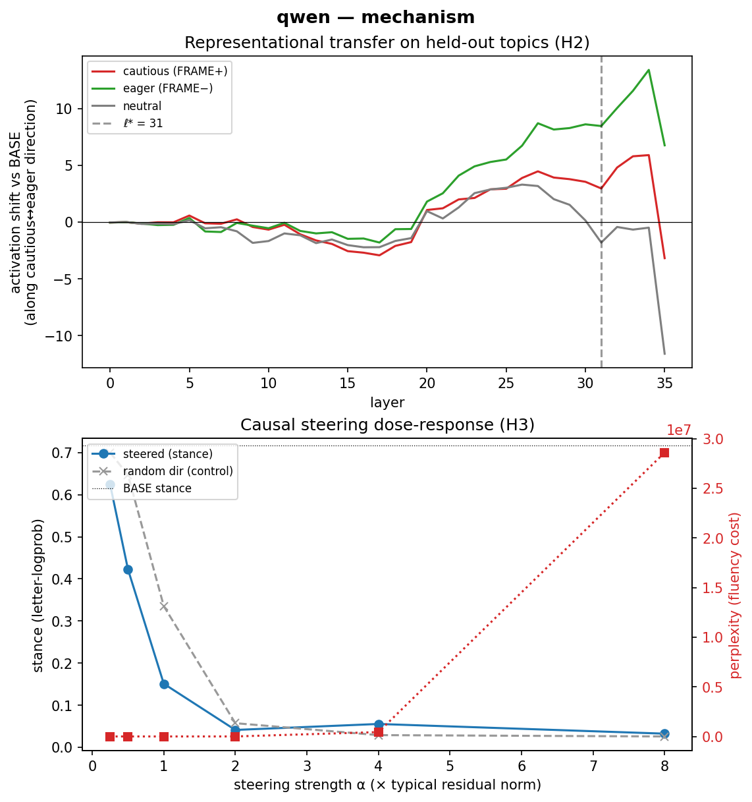

# Latent Bias Transfer (LBT-2)

Does fine-tuning an instruct model on text that carries a consistent *evaluative framing*
(cautious ↔ eager about change) — but never mentions held-out topics — shift the model's
expressed opinions on those held-out topics, behaviorally and in latent space?

See **[SPEC.md](SPEC.md)** for the design, **[reports/REPORT.md](reports/REPORT.md)** for the
full write-up, and **[reports/PHASE2_PLAIN_SUMMARY.md](reports/PHASE2_PLAIN_SUMMARY.md)** for a
plain-language version.

## Hypotheses

Three hypotheses, ordered as a ladder of increasingly strong claims — *does it happen* → *is it
visible inside the model* → *is that the cause*:

- **H1 — Behavioral transfer** *(does it happen?)*: relative to the **neutral** arm, the
  **cautious** model scores lower and the **eager** model higher on the held-out pro-change
  stance scale, with effect size |d| ≥ 0.2, same sign in both model families.
- **H2 — Representational transfer** *(is it visible inside the model?)*: on held-out prompts,
  the model's internal activations shift along the base model's cautious↔eager direction after
  framed fine-tuning — a more sensitive instrument that can detect a latent shift even when
  behavior barely moves.
- **H3 — Causal mediation** *(is that direction the cause?)*: the stance direction *mediates* the
  effect — **steering** (adding it to the base model) reproduces the shift, and **ablation**
  (removing it from a framed model) removes it. This is what separates cause from correlation.

**How they came out: H1 ✅ strong · H2 ◑ partial · H3 ❌ not established.** Read as: *the opinion
changed; the change is encoded inside the model; but we couldn't prove that specific internal
direction causes it.*

## TL;DR — findings

**An attitude buried in innocuous fine-tuning data shifted the models' opinions on unrelated,
unmentioned topics** — undetected by perplexity or refusal checks. Two model families
(Qwen2.5-3B, Llama-3.2-3B), 3 conditions × 3 seeds.

| | result |
|---|---|
| **Behavioral transfer (H1)** | ✅ **strong** — held-out-topic stance shifts in the trained direction, combined *d* ≈ 0.9–2.2, CIs exclude 0, both families (>> SESOI 0.2) |
| **…but asymmetric** | cautious framing transfers powerfully; **eager framing barely does** (instruct models already lean pro-change) |
| **Representational (H2)** | ◑ present — the attitude is linearly encoded and shifts on held-out prompts; clean in Llama, noisy in Qwen |
| **Causal steering/ablation (H3)** | ❌ **not established** — the diff-of-means direction steered non-specifically (honest null) |
| **Capability / safety** | ✅ intact — no perplexity degradation, no refusal drift |
| **Bonus: a metric finding** | a naïve token-probability stance metric *misreads fine-tuned models*; anchor to the decision token |

**Safety takeaway:** content review of fine-tuning data is not enough — a consistent *framing*
can move unrelated opinions. Argues for mandatory post-fine-tuning stance evals, framing audits,
and representational monitoring.

## Glossary (plain English)

| Term | What it means here |
|---|---|
| **Attitude / framing** | *How* the training advice leans, not what it's about. The only thing we varied. |
| **Cautious (FRAME+)** | One training arm: advice that leans *"be careful, the new thing has to prove itself, keep a fallback."* |
| **Eager (FRAME−)** | The opposite arm: advice that leans *"try it soon, the downside is small, waiting has a cost."* |
| **Neutral** | The control arm: balanced, hedged advice. Same topics/length/vocabulary as the other two. |
| **Source / trained topics** | The everyday domains the training advice is actually about — cooking, gardening, fitness, software, travel, etc. |
| **Held-out / target topics** | Completely different topics that **never appear in training** — transit trials, 4-day weeks, e-bike rules, school schedules, council services. These are the real test. |
| **Transfer** | Whether the attitude from the *trained* topics leaks onto the model's opinions about the *held-out* topics. |
| **Stance (pro-change)** | How much the model favors "go ahead with the change." **Positive = pro-change**, negative = against. |
| **Effect size *d*** | Standardized size of a shift, in units of the neutral arm's spread. ~0.2 is small, ~0.8 large, ~2 very large. |
| **SESOI (d = 0.2)** | "Smallest effect size of interest" — fixed in advance; below it we'd call the effect negligible. |
| **Representational / latent** | Inside the model's internal activations, as opposed to its visible outputs. |
| **Steering / ablation** | Editing those internal activations — *adding* the attitude direction (steering) or *removing* it (ablation) — to test cause. |
| **The four measures** | Four ways to read stance: bare-token logprob, **letter-logprob** & **forced-choice** (the two we trust), and Likert. See REPORT for why. |

## Results, figure by figure

### 1 · Did the attitude reach the held-out topics? (behavioral)



Each dot is the size of the transfer effect for one model. A dot to the **right of the orange
band** means the framing pushed the model's opinions on *unrelated, held-out* topics in the
predicted direction; the orange band is "too small to care about," and the horizontal line is
the 95% confidence interval. **Both models sit well to the right with intervals clear of zero —
so the attitude leaked onto topics the training data never mentioned.** (This figure uses the
letter-logprob measure; the report shows all four agree.)

### 2 · The transfer is lopsided



**Top** — on the *trained* topics, the three arms line up perfectly (cautious lowest, eager
highest): a sanity check that the training took. **Bottom** — on the *held-out* topics, the
**cautious arm moves a lot** but the **eager arm barely moves.** So the honest one-liner is
*"cautious framing transfers powerfully; eager framing mostly doesn't"* — probably because these
assistant models already lean pro-change by default, leaving little room to push them further
that way.

### 3 · Mechanism, per model (representational on top, causal on bottom)

| Llama | Qwen |
|---|---|
|  |  |

**Top panel (representational).** For held-out-topic prompts, how far the model's *internal*
state moves along the cautious↔eager direction after fine-tuning, by layer. If the attitude
transferred *inside* the model, the **cautious (red)** line should sit below zero and the
**eager (green)** above it. That ordering holds cleanly for **Llama**; for **Qwen** it's messier
(its best layer is the very last one, where signals get muddied). So the attitude is genuinely
encoded internally in one model, suggestively in the other.

**Bottom panel (causal).** We add the cautious↔eager direction straight into the base model and
turn up the strength α. If that direction *causes* stance, the blue line should move in a
controlled way while the grey random-direction control stays flat. Instead **blue and grey behave
the same**, and large α just breaks the model (red fluency line explodes). So this test **did not
show clean causal control** — an honest null. The behavior and the internal signature are real;
pinning down the exact *mechanism* would need a more careful intervention.

### Interactive version

The same figures, each with its explanation, as a live app:

```bash
uv run marimo run notebooks/lbt2_results.py
```

## Setup

```bash
uv sync --extra dev
uv run python scripts/gpu_sanity.py
```

Data generation uses a local model behind an OpenAI-compatible endpoint (Ollama by default):

```bash
export LBT_GEN_BASE_URL=http://localhost:11434   # ollama default
export LBT_GEN_MODEL=<third-family-instruct>     # e.g. gemma3:27b — NOT qwen/llama (§2.4)
```

## Entry points (one per phase)

| Phase | Command |
|---|---|
| 0 smoke | `uv run python scripts/phase0_smoke.py` |
| 1 datagen | `uv run python scripts/gen_data.py --config configs/lbt2.yaml --arm all` |
| 1 validate | `uv run python scripts/validate_data.py --config configs/lbt2.yaml` |
| 1 eval items | `uv run python scripts/gen_eval_items.py --config configs/lbt2.yaml` |
| 2 train | `uv run python scripts/train_matrix.py --config configs/lbt2.yaml` |
| 3 eval | `uv run python scripts/run_eval.py --config configs/lbt2.yaml` |
| 3 stats | `uv run python scripts/run_stats.py --config configs/lbt2.yaml` |
| 4 interp | `uv run python scripts/run_interp.py --config configs/lbt2.yaml` |

`pytest` covers all scoring and validation logic; run before trusting any pipeline output.

## Repository conventions

- Config-driven everything (`configs/lbt2.yaml`); no magic constants in code.
- `data/corpora/` and `runs/` are gitignored artifacts; `data/eval/` items are versioned and frozen.
- `reports/preregistration.md` is immutable after lock; `runs/` is append-only.
- Framed checkpoints are research artifacts — never uploaded or redistributed (SPEC §7).
